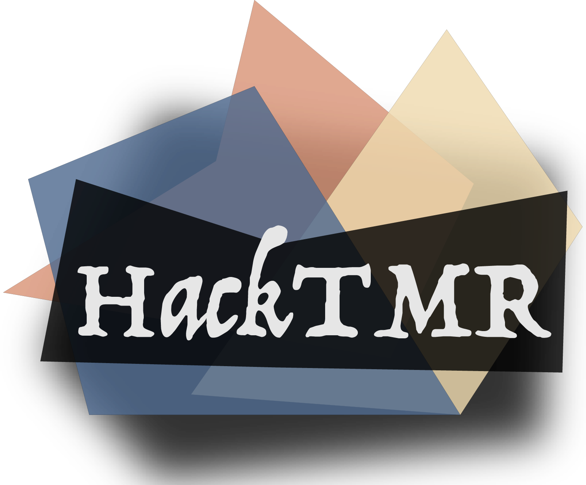

[](https://travis-ci.com/manuelblancovalentin/HackTMR)




# HackTMR: a C++ tool for automated hardware description language manipulation

## What is this for?
HackTMR is a tool for automatic HLS manipulation. It allows the user 
to perform multiple tasks with the purpose of modifying, 
enhancing or visualizing custom HLS code. 

Although this tool is currently only accepting verilog/system-verilog 
codes, we expect to expand it in the future to other languages
such as VHDL. 

The tool acts mainly as a (pseudo)compiler, parsing the HDL language 
introduced by the user in order to get the hierarchy of the design first.
Depending on the structure of the project, the top_design can be inferred
automatically by HacKTMR. As it will be seen later, passing a testbench file
where the top_module is instantiated usually renders the best performance
while using this tool. 

HackTMR is able to detect all verilog/systemverilog instructions, however 
it currently ignores most behavioral blocks. As the original main purpose of this tool
was to provide an easy way to visualize and modify structural data
behavioral blocks were considered not essential (as it is always possible
for the user to provide a gate-level description of the behavioral code and
use that as input to HackTMR). We do expect to be able to parse these blocks in
the future, but for now using and decoding them would slow down the execution of
our tool, thus becoming counter-productive at the current stage of the software.

The code is written in C++ and although it has some dependencies, we have tried to
keep it as self-contained as possible. Writing it in C++ would allow users from any
platform to compile, install and use it. 

Below we introduce HackTMR functionalities and how to use them in your code.


## Installation

```bash
$> git clone git@github.com/manuelblancovalentin/HackTMR
$> cd HackTMR
$> # Install dependencies
$> chmod +x build.sh && chmod +x ./build/dependencies.sh
$> ./build/dependencies.sh
$> ./build.sh --cc=clang --cxx=clang++
```

## How to use

In order to get a list with all the possible options and functionalities HackTMR has
simply type:
```bash
$> ./HackDL -h
```

Table of available arguments


<table>
  <tr>
    <td width="50px"></td>
    <td width="300px">Arguments</td>
    <td>Short</td>
    <td>Default</td>
    <td width="100px" style="width:200px;">Description</td>
    <td>Requires</td>
  </tr>
  <tr>
    <td rowspan="7" width="50px" style="-webkit-transform: rotate(-90deg);-moz-transform: rotate(-90deg);margin:0px;padding:0px;width:20px;">General</td>
    <td><code>--help</code></td>
    <td><code>-h</code></td>
    <td><code>False</code></td>
    <td>Displays help with flag/args list</td>
    <td></td>
</tr>
<tr>
    <td><code>--reload</code></td>
    <td></td>
    <td><code>False</code></td>
    <td>If present, tries to reload old files instead of parsing the ones specified by ``s`` and ``d``</td>
    <td></td>
</tr>
<tr>
    <td><code>--auto-include</code></td>
    <td></td>
    <td><code>False</code></td>
    <td>If present, automatically includes files specified as <code>`include</code> directives in the HDL code.</td>
    <td></td>
</tr>
<tr>
    <td><code>--source</code></td>
    <td><code>-s</code></td>
    <td></td>
    <td>Compulsory. List of source files {.v | .sv} </td>
    <td></td>
</tr>
<tr>
    <td><code>--dependencies</code></td>
    <td><code>-d</code></td>
    <td></td>
    <td>List of directories where required files are present (those included using <code>`include</code>). </td>
    <td></td>
</tr>
<tr>
    <td><code>--name</code></td>
    <td><code>-n</code></td>
    <td></td>
    <td>Name (prefix) of the output files generated by HackTMR. </td>
    <td></td>
</tr>
<tr>
    <td><code>--outpath</code></td>
    <td><code>-o</code></td>
    <td><code>.</code></td>
    <td>Directory where HackTMR will save generated output files. </td>
    <td></td>
</tr>
  <tr>
    <td rowspan="1" width="50px" style="-webkit-transform: rotate(-90deg);-moz-transform: rotate(-90deg);margin:0px;padding:0px;width:20px;">Patterns</td>
    <td><code>--pattern</code></td>
    <td><code>-p</code></td>
    <td><code></code></td>
    <td>Pattern of the elements HackTMR will look for and apply a certain operation/instruction specified by the user. This pattern must follow the <a href="https://www.regular-expressions.info/reference.html">RegEx</a> standard.</td>
    <td></td>
</tr>
  <tr>
    <td rowspan="2" width="50px" style="-webkit-transform: rotate(-90deg);-moz-transform: rotate(-90deg);margin:0px;padding:0px;width:20px;">Triplication</td>
    <td><code>--tmr {int}</code></td>
    <td></td>
    <td><code>3</code></td>
    <td>When set to an integer {0 | 1 | 2 | 3} applies triplication to the instances/modules with the pattern specified using <code>-p</code>.<br/>0: Only regs<br/>1:Regs + clk<br/>2: clock skewing<br/>3: Full TMR</td>
    <td><code>-p<br/>&nbsp;-s<br/>&nbsp;-d</code></td>
</tr>
<tr>
    <td><code>--tmr-suffix</code></td>
    <td></td>
    <td><code>_TMR</code></td>
    <td>Suffix to be added to the output files after triplication applied. </td>
    <td><code>--tmr</code></td>
</tr>
  <tr>
    <td rowspan="1" width="50px" style="-webkit-transform: rotate(-90deg);-moz-transform: rotate(-90deg);margin:0px;padding:0px;width:20px;">Monitoring</td>
    <td><code>--monitor</code></td>
    <td></td>
    <td><code>False</code></td>
    <td>When present, it generates an output verilog file that performs monitoring of signals with the pattern specified by <code>-p</code>, which can be included to testbenches for verification.</td>
    <td><code>-p<br/>&nbsp;-s<br/>&nbsp;-d</code></td>
</tr>
<tr>
    <td rowspan="4" width="50px" style="-webkit-transform: rotate(-90deg);-moz-transform: rotate(-90deg);margin:0px;padding:0px;width:20px;">Single-Event effects</td>
    <td><code>--see</code></td>
    <td></td>
    <td><code>False</code></td>
    <td>When present, it generates an output verilog file that simulates single event effects on signals with the pattern specified by <code>-p</code>, which can be included to testbenches for verification.</td>
    <td><code>-p<br/>&nbsp;-s<br/>&nbsp;-d</code></td>
</tr>
<tr>
    <td><code>--sim-pulses</code></td>
    <td></td>
    <td><code>1</code></td>
    <td>Number of simultaneous pulses for SEE verification.</td>
    <td><code>--see</code></td>
</tr>
<tr>
    <td><code>--max-upset-time</code></td>
    <td></td>
    <td><code>10</code></td>
    <td>Max upset time for upset pulses for SEE verification.</td>
    <td><code>--see</code></td>
</tr>
<tr>
    <td><code>--min-upset-time</code></td>
    <td></td>
    <td><code>1</code></td>
    <td>Min upset time for upset pulses for SEE verification.</td>
    <td><code>--see</code></td>
</tr>
</table>


### Hierarchy inspection
Most digital architectures have a pretty well idea of what the hierarchy of their
HDL code looks like, but sometimes it might happen that our designs get so big that
we need to take a look at the whole structure; or maybe we need to use or modify
someone else's code.

In those cases, it is useful to take a look at the structure of the design. Although
you can see this hierachy using property tools like Cadence Genus, Xcelium or others,
these tools are usually installed in a single server to which we might not necessarily
have access at all times. Apart from that, if that specific code is not compilable,
those tools will not allow you to visualize the structure. Furthermore, if your code is
missing some libraries or files, it is impossible to use such tools to check the hierarchy
of the design.

HackTMR offers HDL designers the ability to parse a set of HDL codes and display the
hierarchy of the design even if the code is not compilable or it has missing libraries
or files. Our software has been optimized to run as fast as possible, so that such tasks
can be executed rapidly and efficiently in order to guarantee that the design workflow can
move forward.

The easiest way to get the hierarchy of a certain design is to point HackTMR to
such file with the ``--source`` or ``-s`` flag. This flag should point to a
``verilog`` or ``systemverilog`` file containing the top_module (although it
can contain any other modules apart from the top).

If such file has dependencies on other files, and uses instructions such as
`` `include <other_file>.{v | sv} `` then you need to specify the path or paths
to the folders where these files can be found and HackTMR will look for them
automatically. This path can be specified with the ``--dependencies`` or ``-d``
flag.

Any instruction passed to HackTMR will generate some outputs. The outputs
will be stored in the directory pointed by the flag ``--output`` or ``-o``.
If not specified, the software will try to create a new directory in the
current working directory.

The name of the outputs can also be specified using the ``--name`` or ``-n``
flag.

Thus, the pattern for an instruction to get the hierarchy of a design is
shown below:

```bash
$> HackDL -n <out_name> 
          -s <path_file_top_design>.{v | sv}
          -d <path_to_sources> 
          -o <output_path>
```

For a particular example see [this](./res/docs/basics.md).


### Module renaming/extraction/deletion
> TODO

### Triple Module Redundancy (TMR)
> TODO

###  Generation of signals monitor testbench
> TODO

### Single-Event Effects modeling
> TODO


## Verilog Cheatsheet

### Line-break instructions
These instructions start and look for a new-line ending. Anything between their start-word and the next \n (end of the line) will be considered as part of the instruction.

| Instruction   |      Example      |  Start word | End word | Ignore Recursive? |
|---------------|:-----------------:|:------------:|:---------:|:---------------:|
| include		  | ``include <module>` |  \`         | \n |✅|
| define       | ``define <module>`  | \`          | \n |✅|
| timescale    | ``timescale 1ns/1ps`| \`          | \n |✅|
| Single-line Comment | `\\ Comment` | \\\         | \n |✅|


These instructions are easily parsed precisely because they do not need accumulation at all. Once you find a word, you can match it. Also, we don't care about any further keywords that might appear. For instance, an include followed by the word define in the same sentence, should be captured as an include. The define is ignored. Thus, we can ignore any recursive search for other keywords. 


### Recursivity-blocking instructions
Say that we find the start of a block comment ``/*``, we know that we have to keep looking until we find the end of that comment ``*/``. That can happen either in the same line or in following lines. If it's not in the same line, then we gotta ignore whatever there is on those lines until we find the endword. No matter if there's an initial/always/module block, whatever. It's all a comment. All of these are nul. These are recursivity-blocking instructions. 

| Instruction   |      Example      |  Start word | End word | Ignore Recursive? |
|---------------|:-----------------:|:------------:|:---------:|:---------------:|
| Multi-line comment | ``\* example *\`` |  ``\*`` | ``*\`` |✅|


## Citing us
Please, consider citing us in your publications if you found this code useful. If so, please use the following bib entry:

```
@misc{hackdl,
  author = {B. Valentin, Manuel and Ogrenci-Memik, Seda and Fahim, Farah and Miranda, Llovizna},
  title = {HackDL: a C++ tool for automated hardware description language manipulation},
  year = {2021},
  publisher = {GitHub},
  journal = {GitHub repository},
  howpublished = {\url{https://github.com/manuelblancovalentin/HackDL}
}
```